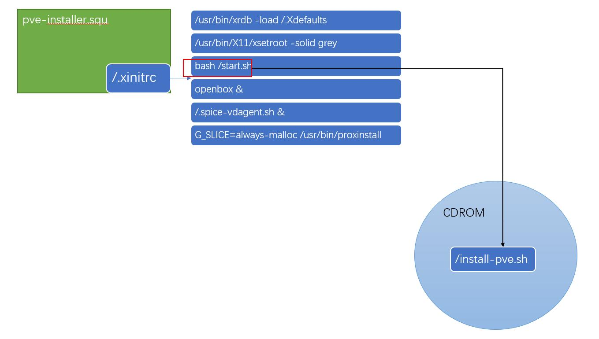

#  Proxmox VE  unattend install 
## Note

we can find proxmox-installer source on https://git.proxmox.com/?p=pve-installer.git;a=blob;f=proxinstall;h=f9b67a37e042ed7503238e8cf4c2dd19e1ae5de8;hb=refs/heads/master

We can find this in proxmox-ve.iso

- debian-base-rootfs -->pve-base.squ

- pve-installer -->pve-base.squ


I add a `start.sh` to `.xinitrc`(pve-installer). 

```
root@jammy:~/2/proxmox/packages# cat /tmp/iso/squashfs-root/.xinitrc 
/usr/bin/xrdb -load /.Xdefaults
/usr/bin/X11/xsetroot -solid grey
bash /start.sh
openbox &
/.spice-vdagent.sh &
G_SLICE=always-malloc /usr/bin/proxinstall
```

`start.sh` will executes `install-pve.sh` file which in  `/cdrom `.



Now, We can edit `install-pve.sh` if we want to do more.

## files

- geniso.sh    ->modify iso
- install_pve_to_rootfs-for-pve-base.sh    ->old scripts
- install-pve.sh ->install pve to disk shell scripts
- sart.sh ->add to .xinitrc
- rootfs.sh -> diy rootfs
- msg.conf -> conffile

## ISOFILE
```
root@jammy:~/2# tree -L 1
.
├── COPYING
├── COPYRIGHT
├── EULA
├── Release.txt
├── System
├── boot
├── debian -> .
├── dists
├── efi.img
├── install-pve.sh
├── mach_kernel
├── proxmox
├── pve-base.squashfs
└── pve-installer.squashfs
```

iso download link
https://mirrors.apqa.cn/d/proxmox-edge/unofficialiso/PVE7.iso


# How to use

## Use UltraISO to modify iso

## Create cluster server's config  -->msg.conf

Don't more or less

```
root@Devops:~# cat /tmp/msg.conf
#this is config file
#mac fq dn  ip_addr cidr  gateway install_way time_zone passwd  pvedisk
EA:5A:F0:5A:B3:D2 pve2 bingsin.com 10.13.14.22 24  10.13.14.252 cdrom Asia/Shanghai P@SSword /dev/sda
```
install_way --> apt|cdrom, use apt has some error now.

## Choose load conf way. 

### Config file with http   --> modify install-pve.sh

```
#how to load config_file from http or cdrom (whitch is use local conf-file)
#you must set http_conf_url if you want't use http.
config_file="http"
http_conf_url="http://192.168.3.120:801/msg.conf"
```

replace `install-pve.sh` in iso with your install-pve.sh

and push `msg.conf` to your webserver wwwroot
 
### Config file with cdrom  --> modify install-pve.sh

```
#how to load config_file from http or cdrom (whitch is use local conf-file)
#you must set http_conf_url if you want't use http.
config_file="cdrom"
#http_conf_url="http://192.168.3.120:801/msg.conf"
```

replace `install-pve.sh` in iso with your install-pve.sh

and add `msg.conf` to your iso root

## Save your iso and use pxe-iso-2-pxe 

see https://github.com/morph027/pve-iso-2-pxe

中文参考 "https://foxi.buduanwang.vip/virtualization/pve/1385.html/" and "
https://www.bilibili.com/video/BV1t84y1474u/“


# Next

- make scripts readable and intelligent.         --done
- load config file from cdrom or lan.            --done
- can add more package like ceph and so on.
- add legacy and uefi mode support, only support uefi now. --done
- test with physical server 
- fix apt installtion error